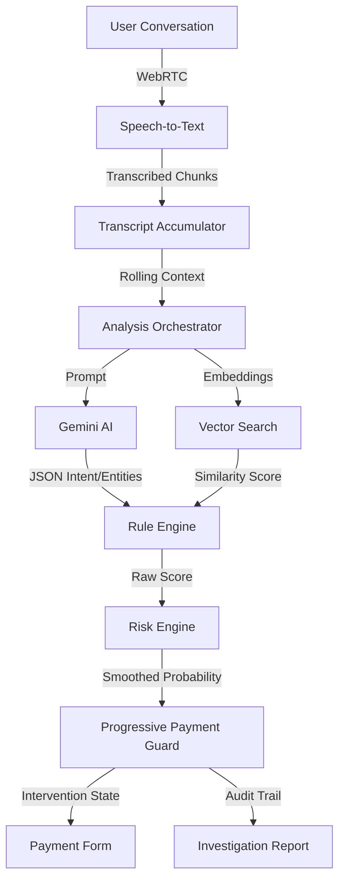

<div align="center">
  
  
  # Kavach AI
  **Real-Time Explainable Voice Scam Detection & Adaptive Payment Protection**

  <p align="center">
    
    
    
    
    
  </p>
</div>

---

## 📌 Overview

The exponential rise of AI-generated voice cloning and organized tele-fraud operations has created a severe vulnerability in digital banking. Traditional fraud detection systems are strictly reactive—they analyze transactional data only *after* the money has already left the victim's account, leaving users exposed to devastating financial loss.

**Kavach AI flips the paradigm.** 

Kavach is an intelligent security layer that sits between the user's communication channel and their banking interface. By actively analyzing live conversational context using Large Language Models and a deterministic risk engine, Kavach identifies psychological manipulation, urgency patterns, and impersonation attempts in real-time—intervening *before* the transaction completes.

---

## ✨ Key Features

### 🎤 Real-Time Voice Intelligence
* **Live Speech Transcription:** Streams continuous audio via WebRTC and converts it into text chunks instantly.
* **Continuous Conversation Monitoring:** Accumulates contextual history, ensuring long-con scenarios are not missed.
* **Intent Analysis:** Identifies underlying caller intent (e.g., authoritative threats vs. informative reminders).
* **Scam Categorization:** Classifies ongoing threats into recognized vectors like KYC Fraud, RBI Impersonation, or Family Emergencies.
* **Emotional Tone Analysis:** Detects the injection of panic, urgency, or psychological manipulation.

### 🧠 Explainable AI Engine
* **Hybrid AI + Rule Engine:** Combines the semantic understanding of LLMs with strict, point-based deterministic rules.
* **Semantic Similarity Matching:** Uses `text-embedding-004` to compare the live conversation against a vectorized database of known scam signatures.
* **RAG-Backed Reasoning:** Grounds its decision-making in verified regulatory guidelines (RBI, CERT-In, NPCI).
* **Transparent Decision Making:** Outputs the precise reasoning and rules triggered, ensuring AI decisions are never "black box."
* **False-Positive Mitigation:** Implements intelligent contextual gating (e.g., distinguishing between a legitimate banking reminder and a phishing attempt).

### 🛡 Adaptive Payment Protection
Rather than frustrating users with binary "allow/block" locks, Kavach progressively scales friction to match the AI-determined risk level:
* **Safe** → **Warning Banner** → **Warning Dialog** → **High-Risk Confirmation** → **Automatic Transaction Block**.

### 📄 Investigation Report
Every intervened transaction produces a dynamic, PDF-exportable Investigation Report containing:
* Threat score & scam category
* Triggered deterministic rules
* A precise AI summary and reasoning
* RAG citations and retrieved regulatory precedents
* An annotated conversation timeline

---

## 🏗 Architecture



---

## ⚙️ How It Works

1. **Audio Capture:** Securely accesses the user's microphone using WebRTC and streams the audio buffer.
2. **Speech Recognition:** Converts the live audio stream into continuous text chunks.
3. **AI Analysis:** The Analysis Orchestrator batches the context and requests structural entity extraction and semantic similarity from Gemini 2.5 Flash.
4. **Rule Evaluation:** The Rule Engine ingests the LLM output, triggering deterministic fraud indicators (e.g., `Authority Impersonation`, `Credential Request`).
5. **Risk Scoring:** The Risk Engine calculates an adaptive, smoothed probability score combining weighted rules and semantic similarity bonuses.
6. **Payment Protection:** The Progressive Payment Guard intercepts any outgoing transaction request if the Risk Score breaches established thresholds.
7. **Investigation Report:** A detailed breakdown of the threat vectors is generated for user review and audit logging.

---

## 🚦 Progressive Payment Workflow

Kavach employs an adaptive security model that respects user agency while strictly protecting against severe threats. 

| Risk Score | System Behaviour |
| :--- | :--- |
| **0–20** | **Payment proceeds normally** (Invisible protection) |
| **20–50** | **Warning banner** (Subtle contextual UI warning) |
| **50–70** | **Warning dialog** (Requires user to click "Continue Anyway") |
| **70–90** | **High-risk confirmation** (Requires explicit checkbox acknowledgment of risks) |
| **90–100** | **Transaction blocked** (Total lockdown; routes to Investigation Report) |

**Why Progressive Protection?**
Hard-blocking transactions based purely on AI models often leads to extreme user frustration due to false positives. By scaling the friction (banners → checkboxes → blocks) proportionally to the AI confidence score, Kavach provides enterprise-grade security while maintaining a seamless user experience for legitimate transactions.

---

## 🛠 Tech Stack

### Frontend
  

### AI & Embeddings
  

### Speech & Telemetry
  

### Security & Architecture
 

---

## 📂 Project Structure

```text
kavachai/
├── server/                    # Node.js backend proxy & AI orchestration
│   ├── .env
│   ├── index.js
│   └── services/              # Inference, Speech, and Embedding Orchestrators
├── src/                       # React frontend
│   ├── ai/                    # RuleEngine, RiskEngine, SCORING_CONFIG
│   ├── components/            # UI components (PaymentGuard, InvestigationReport, etc.)
│   ├── hooks/                 # useLiveAnalysis custom hook
│   ├── webrtc/                # Stream handlers
│   ├── App.jsx                # Main application orchestrator
│   └── index.css              # Global styling & Tailwind utilities
├── package.json
└── README.md
```

---

## 📸 Screenshots

*<p align="center">Note: Replace these placeholders with actual screenshots from the application.</p>*

<details>
<summary><b>Landing Page & Dashboard</b></summary>
<p align="center">
  <i>[Placeholder: Landing Page Screenshot]</i><br>
  <i>[Placeholder: Main Dashboard & Threat Meter Screenshot]</i>
</p>
</details>

<details>
<summary><b>Progressive Payment Interventions</b></summary>
<p align="center">
  <i>[Placeholder: Payment Screen (Warning Banner)]</i><br>
  <i>[Placeholder: Warning Dialog Modal (50-70 Risk)]</i><br>
  <i>[Placeholder: High-Risk Confirmation Modal (70-90 Risk)]</i><br>
  <i>[Placeholder: Blocked Transaction Modal (>90 Risk)]</i>
</p>
</details>

<details>
<summary><b>Explainability</b></summary>
<p align="center">
  <i>[Placeholder: AI Investigation Report Screenshot]</i>
</p>
</details>

---

## 🚀 Installation

### Prerequisites
- Node.js (v18 or higher)
- Google Cloud Vertex AI credentials (Service Account JSON)

### 1. Clone the Repository
```bash
git clone https://github.com/your-org/kavachai.git
cd kavachai
```

### 2. Install Dependencies
```bash
# Install frontend dependencies
npm install

# Install server dependencies
cd server
npm install
cd ..
```

### 3. Environment Setup
Configure your environment variables for both the client and server.

**Server (`server/.env`):**
```env
GOOGLE_APPLICATION_CREDENTIALS=/path/to/your/vertex-ai-service-account.json
GCP_PROJECT_ID=your-project-id
GCP_LOCATION=us-central1
```

### 4. Run the Application
The frontend and backend must be run concurrently.

```bash
# In terminal 1 (Start the backend proxy)
cd server
npm start

# In terminal 2 (Start the React app)
npm run dev
```

Navigate to `http://localhost:5173` to access the Kavach UI.

---

## 🧪 Demo Scenarios

We have rigorously tested Kavach against multiple real-world scenarios.

| Scenario | Expected Outcome | System Behaviour |
| :--- | :--- | :--- |
| **Normal Conversation** | Safe Payment | Passes gracefully; 0-5% Risk. |
| **Legitimate Bank Reminder** | No False Positive | Acknowledges financial topic; gated by intent rules. |
| **Family Emergency** | Warning | Triggers subtle banner due to high urgency / panic. |
| **Lottery Scam** | Warning Dialog | Triggers 50-70 Risk; requires user to bypass. |
| **KYC Scam** | High-Risk Confirmation | Triggers 70-90 Risk; demands explicit acknowledgment. |
| **RBI Impersonation** | High-Risk Protection | Triggers 85-95 Risk; extreme caution enforced. |
| **OTP + Credential Scam** | Transaction Blocked | Triggers 97-100 Risk; instant lockdown. |

---

## 💡 Design Highlights

- **Explainable AI (XAI):** Kavach never hides behind a percentage score. Every intervention explicitly lists the rules triggered (e.g., "Caller requested OTP", "Caller claimed to be Authority") so the user understands exactly *why* they are being protected.
- **False-Positive Reduction:** Pure AI can be overzealous. By blending LLM semantic extraction with a deterministic Rule Engine, Kavach ignores legitimate conversations (like a bank calling about a due date) unless malicious intent (requesting PINs/money) is also present.
- **Human-Centered Security:** The progressive workflow avoids user fatigue by allowing safe transactions to proceed seamlessly while only creating friction when genuine threats emerge.

---

## 🔮 Future Scope

- **Core Banking API Integration:** Deep linking with existing Core Banking Systems (CBS) to automatically freeze outbound transfers when an active scam session is detected.
- **Mobile SDK Integration:** Porting the Kavach architecture into a lightweight SDK embeddable directly into Android/iOS banking applications.
- **Federated Scam Intelligence:** Sharing anonymized scam vectors and embeddings securely across multiple banking institutions to dynamically update the global threat model.
- **Multilingual Support:** Extending prompt parsing and rule detection to support regional Indian languages (Hindi, Marathi, Tamil, etc.).
- **Hardware Enclaves:** Pushing deterministic rule execution to secure on-device enclaves to guarantee zero latency.

---

## 👨‍💻 Team

**TEAM De-GenZ**
- *Swapnil*
- *Akul* 

---

<div align="center">
  <b>Built with ❤️ to stop digital fraud before it happens.</b>
</div>
