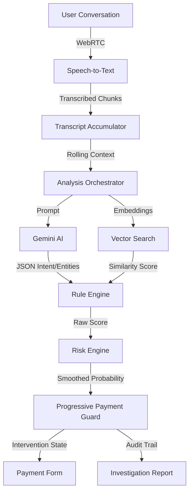

<div align="center">
  
  
  # Kavach AI
  **Real-Time Explainable Voice Scam Detection & Adaptive Payment Protection**

  <p align="center">
    
    
    
    
    
  </p>
</div>

---

## 📌 Overview

The exponential rise of AI-generated voice cloning and organized tele-fraud operations has created a severe vulnerability in digital banking. Traditional fraud detection systems are strictly reactive—they analyze transactional data only *after* the money has already left the victim's account, leaving users exposed to devastating financial loss.

**Kavach AI flips the paradigm.** 

Kavach is an intelligent security layer that sits between the user's communication channel and their banking interface. By actively analyzing live conversational context using Large Language Models and a deterministic risk engine, Kavach identifies psychological manipulation, urgency patterns, and impersonation attempts in real-time—intervening *before* the transaction completes.

---

## ✨ Key Features

### 🎤 Real-Time Voice Intelligence
* **Live Speech Transcription:** Streams continuous audio via WebRTC and converts it into text chunks instantly.
* **Continuous Conversation Monitoring:** Accumulates contextual history, ensuring long-con scenarios are not missed.
* **Intent Analysis:** Identifies underlying caller intent (e.g., authoritative threats vs. informative reminders).
* **Scam Categorization:** Classifies ongoing threats into recognized vectors like KYC Fraud, RBI Impersonation, or Family Emergencies.
* **Emotional Tone Analysis:** Detects the injection of panic, urgency, or psychological manipulation.

### 🧠 Explainable AI Engine
* **Hybrid AI + Rule Engine:** Combines the semantic understanding of LLMs with strict, point-based deterministic rules.
* **Semantic Similarity Matching:** Uses `text-embedding-004` to compare the live conversation against a vectorized database of known scam signatures.
* **RAG-Backed Reasoning:** Grounds its decision-making in verified regulatory guidelines (RBI, CERT-In, NPCI).
* **Transparent Decision Making:** Outputs the precise reasoning and rules triggered, ensuring AI decisions are never "black box."
* **False-Positive Mitigation:** Implements intelligent contextual gating (e.g., distinguishing between a legitimate banking reminder and a phishing attempt).

### 🛡 Adaptive Payment Protection
Rather than frustrating users with binary "allow/block" locks, Kavach progressively scales friction to match the AI-determined risk level:
* **Safe** → **Warning Banner** → **Warning Dialog** → **High-Risk Confirmation** → **Automatic Transaction Block**.

### 📄 Investigation Report
Every intervened transaction produces a dynamic, PDF-exportable Investigation Report containing:
* Threat score & scam category
* Triggered deterministic rules
* A precise AI summary and reasoning
* RAG citations and retrieved regulatory precedents
* An annotated conversation timeline

---

## 🏗 Architecture



---

## ⚙️ How It Works

1. **Audio Capture:** Securely accesses the user's microphone using WebRTC and streams the audio buffer.
2. **Speech Recognition:** Converts the live audio stream into continuous text chunks.
3. **Two-Stage AI Analysis:** When a chunk is flushed, **Stage 1** runs synchronously (<0.1 ms) using `localFallbackAnalyzer` (keyword matching) to produce an instant provisional risk score, activating payment friction tiers immediately. **Stage 2** sends the chunk to Gemini 2.5 Flash for deep semantic entity extraction (~9–13 s). The provisional score is labeled as such in the UI and PaymentGuard tiers only relax after Stage 2 confirms a lower risk. See [Two-Stage Detection & Interim Protection](#-two-stage-detection--interim-protection) for recall tradeoffs.
4. **Rule Evaluation:** The Rule Engine ingests the LLM output, triggering deterministic fraud indicators (e.g., `Authority Impersonation`, `Credential Request`).
5. **Risk Scoring:** The Risk Engine calculates an adaptive, smoothed probability score combining weighted rules and semantic similarity bonuses.
6. **Payment Protection:** The Progressive Payment Guard intercepts any outgoing transaction request if the Risk Score breaches established thresholds.
7. **Investigation Report:** A detailed breakdown of the threat vectors is generated for user review and audit logging.

---

## 🔀 Two-Stage Detection & Interim Protection

Every transcript chunk triggers a two-stage pipeline designed to balance **speed** (zero-latency friction) with **accuracy** (Gemini semantic understanding):

| | Stage 1 — Instant | Stage 2 — Confirmed |
|---|---|---|
| **Engine** | `localFallbackAnalyzer` + `RuleEngine` | Gemini 2.5 Flash + `RuleEngine` + RAG |
| **Latency** | < 0.1 ms (synchronous, in-browser) | ~9–13 s (Cloud Run + LLM inference) |
| **Output** | `interimRiskScore` (provisional) | `displayProbability` (authoritative) |
| **Purpose** | Activate payment friction immediately | Confirm or correct Stage 1 assessment |
| **UI label** | "REFINING WITH AI ANALYSIS… / Stage 1 score is provisional (keyword-only)" | Score updates, "Confirmed: lower risk" pill if corrected downward |

**How they interact:**
1. When a transcript chunk is flushed, Stage 1 runs synchronously and `interimRiskScore` is published immediately. `effectiveRiskScore = max(displayProbability, interimRiskScore)` so PaymentGuard friction tiers can only **escalate** during this window.
2. Stage 2 begins as an async Gemini call. `isAnalyzingChunk = true` the entire time.
3. When Stage 2 completes, `interimRiskScore` resets to 0 and `displayProbability` (the smoothed Gemini-backed score) takes over. If Stage 2 returns a score meaningfully lower than Stage 1's peak, a "✓ Confirmed: lower risk than initial estimate" micro-message is shown so the score decrease reads as a correction, not a glitch.
4. **Tier relaxation is gated on `stage2Confirmed = true`** — PaymentGuard friction tiers never step down until Gemini has completed at least one cycle, preventing a scammer from exploiting rapid re-analysis to lower friction mid-call.

> [!CAUTION]
> **Known Tradeoff — Stage 1 is the lowest-recall engine in the system.**
> Stage 1 uses `localFallbackAnalyzer` — the **same keyword-regex engine** documented in the [⚠️ Local Fallback Engine Accuracy & Quality Disclosure](#%EF%B8%8F-local-fallback-engine-accuracy--quality-disclosure) section below. Its recall on the 32-sample adversarial test set is:
> - **~85.0%** at MEDIUM threshold  
> - **~50.0%** at HIGH threshold  
> - **~20.0%** at CRITICAL threshold  
>
> Stage 1 provides **fast but lower-confidence friction**. Stage 2 (Gemini) provides **slower but higher-confidence confirmation (~70% CRITICAL recall)**. The UI makes this explicit: the interim score is labeled "provisional (keyword-only)" and PaymentGuard shows a "Stage 1 Score — Provisional" banner with the recall gap called out. Do not interpret a Stage 1 score crossing the CRITICAL threshold as a high-confidence fraud detection — it is a precautionary hold pending Gemini confirmation.

---

## ⏱ End-to-End Detection Latency

Real-time performance in Kavach AI is governed by the **End-to-End (E2E) Pipeline Latency** from audio chunk finalization to UI state publication:

$$\text{Latency}_{\text{E2E}} = t_{\text{Chunk Finalize}} \rightarrow t_{\text{Network Roundtrip (/api/analyze)}} \rightarrow t_{\text{Rule Engine}} \rightarrow t_{\text{Risk Engine}} \rightarrow t_{\text{UI State Publish}}$$

| Processing Path | Engine | Avg Latency | P50 (Median) | P95 Latency | Operational Bottleneck |
|---|---|---|---|---|---|
| **Gemini Path (Cloud)** | Vertex AI (Gemini 1.5 Flash) + RAG | **~13,421 ms** | **~12,686 ms** | **~25,777 ms** | Cloud Run Network RTT + Gemini LLM Inference |
| **Fallback Path (Local)** | Keyword Regex (`localFallbackAnalyzer`) | **~0.026 ms** | **~0.019 ms** | **~0.041 ms** | In-browser JS Regex |
| **Rule Engine Only** | Point Scoring (`ruleEngine.ts`) | **~0.006 ms** | **~0.0005 ms** | **~0.020 ms** | In-memory calculation |

> ⚠ **Real-Time Performance Note**: Pure rule engine execution (~0.006 ms) is negligible. **End-to-End pipeline latency (~13.4 s average on Gemini path vs ~0.026 ms on Fallback path)** is the true metric for real-world detection speed. This latency gap is precisely why Stage 1 interim protection exists.


---

## 🚦 Progressive Payment Workflow

Kavach employs an adaptive security model that respects user agency while strictly protecting against severe threats. 

| Risk Score | System Behaviour |
| :--- | :--- |
| **0–20** | **Payment proceeds normally** (Invisible protection) |
| **20–50** | **Warning banner** (Subtle contextual UI warning) |
| **50–70** | **Warning dialog** (Requires user to click "Continue Anyway") |
| **70–90** | **High-risk confirmation** (Requires explicit checkbox acknowledgment of risks) |
| **90–100** | **Transaction blocked** (Total lockdown; routes to Investigation Report) |

**Why Progressive Protection?**
Hard-blocking transactions based purely on AI models often leads to extreme user frustration due to false positives. By scaling the friction (banners → checkboxes → blocks) proportionally to the AI confidence score, Kavach provides enterprise-grade security while maintaining a seamless user experience for legitimate transactions.

---

## 🛠 Tech Stack

### Frontend
  

### AI & Embeddings
  

### Speech & Telemetry
  

### Security & Architecture
 

---

## 📂 Project Structure

```text
kavachai/
├── server/                    # Node.js backend proxy & AI orchestration
│   ├── .env
│   ├── index.js
│   └── services/              # Inference, Speech, and Embedding Orchestrators
├── src/                       # React frontend
│   ├── ai/                    # RuleEngine, RiskEngine, SCORING_CONFIG
│   ├── components/            # UI components (PaymentGuard, InvestigationReport, etc.)
│   ├── hooks/                 # useLiveAnalysis custom hook
│   ├── webrtc/                # Stream handlers
│   ├── App.jsx                # Main application orchestrator
│   └── index.css              # Global styling & Tailwind utilities
├── package.json
└── README.md
```

---

## 📸 Screenshots

<details>
<summary><b>🏠 Landing Page & Dashboard</b></summary>
<br>
<table align="center" width="100%">
  <tr>
    <td width="50%" align="center">
      
      <br><i>Landing Page</i>
    </td>
    <td width="50%" align="center">
      
      <br><i>Main Dashboard</i>
    </td>
  </tr>
</table>
</details>

<details>
<summary><b>🛡 Progressive Payment Protection</b></summary>
<br>
<p align="center">
  
  <br><i><b>Risk 0–20:</b> Safe Payment Success</i>
</p>
<table align="center" width="100%">
  <tr>
    <td width="50%" align="center">
      
      <br><i><b>Risk 20–50:</b> Subtle Warning Banner</i>
    </td>
    <td width="50%" align="center">
      
      <br><i><b>Risk 50–70:</b> Warning Dialog</i>
    </td>
  </tr>
  <tr>
    <td width="50%" align="center">
      
      <br><i><b>Risk 70–90:</b> High-Risk Confirmation (Requires Checkbox)</i>
    </td>
    <td width="50%" align="center">
      
      <br><i><b>Risk 90–100:</b> Complete Transaction Block</i>
    </td>
  </tr>
</table>
</details>

<details>
<summary><b>📄 Explainable AI</b></summary>
<br>
<p align="center">
  
  <br><br>
  <i>Every AI decision is fully explainable through the generated Investigation Report, detailing exactly which deterministic rules and contextual indicators triggered the intervention.</i>
</p>
</details>

---

## 🚀 Installation

### Prerequisites
- Node.js (v18 or higher)
- Google Cloud Vertex AI credentials (Service Account JSON)

### 1. Clone the Repository
```bash
git clone https://github.com/your-org/kavachai.git
cd kavachai
```

### 2. Install Dependencies
```bash
# Install frontend dependencies
npm install

# Install server dependencies
cd server
npm install
cd ..
```

### 3. Environment Setup
Configure your environment variables for both the client and server.

**Server (`server/.env`):**
```env
GOOGLE_APPLICATION_CREDENTIALS=/path/to/your/vertex-ai-service-account.json
GCP_PROJECT_ID=your-project-id
GCP_LOCATION=us-central1
```

### 4. Run the Application
The frontend and backend must be run concurrently.

```bash
# In terminal 1 (Start the backend proxy)
cd server
npm start

# In terminal 2 (Start the React app)
npm run dev
```

Navigate to `http://localhost:5173` to access the Kavach UI.

---

## 🧪 Demo Scenarios

We have rigorously tested Kavach against multiple real-world scenarios.

| Scenario | Expected Outcome | System Behaviour |
| :--- | :--- | :--- |
| **Normal Conversation** | Safe Payment | Passes gracefully; 0-5% Risk. |
| **Legitimate Bank Reminder** | No False Positive | Acknowledges financial topic; gated by intent rules. |
| **Family Emergency** | Warning | Triggers subtle banner due to high urgency / panic. |
| **Lottery Scam** | Warning Dialog | Triggers 50-70 Risk; requires user to bypass. |
| **KYC Scam** | High-Risk Confirmation | Triggers 70-90 Risk; demands explicit acknowledgment. |
| **RBI Impersonation** | High-Risk Protection | Triggers 85-95 Risk; extreme caution enforced. |
| **OTP + Credential Scam** | Transaction Blocked | Triggers 97-100 Risk; instant lockdown. |

---

## 💡 Design Highlights

- **Explainable AI (XAI):** Kavach never hides behind a percentage score. Every intervention explicitly lists the rules triggered (e.g., "Caller requested OTP", "Caller claimed to be Authority") so the user understands exactly *why* they are being protected.
- **False-Positive Reduction:** Pure AI can be overzealous. By blending LLM semantic extraction with a deterministic Rule Engine, Kavach ignores legitimate conversations (like a bank calling about a due date) unless malicious intent (requesting PINs/money) is also present.
- **Human-Centered Security:** The progressive workflow avoids user fatigue by allowing safe transactions to proceed seamlessly while only creating friction when genuine threats emerge.

---

---

## 🌐 Language Support & Code-Mixing

Kavach AI supports multi-lingual real-time analysis across English, Hindi, and Hinglish:
- **Speech Recognition**: WebSocket streaming STT supporting `en-US` and `hi-IN`.
- **Gemini NLP Engine**: Prompted to process Hindi / Hinglish code-mixed transcripts and map entities to the standardized fraud JSON schema.
- **Local Fallback**: Keyword bank includes Hindi scam terminology (`police wala`, `giraftari`, `daroga`, `khata number`, `otp batao`, `paise bhejo`, `warrant`).
- **Scam Signatures**: Includes dedicated Hindi simulation profiles (`police_hindi`, `banking_hindi`).

---

## 📋 Data & Validation Notes

### Sourcing of Scam Signatures & Vocabulary
The Hindi/Hinglish scam simulation profiles in `src/ai/scam-signatures.js` and local keyword banks in `src/ai/localFallbackAnalyzer.ts` were authored based on public regulatory advisories and cybercrime bulletins, including:
1. **RBI Public Press Releases & Advisories**:
   - *Digital Arrest Scam Warning* ([PR No. 56702](https://rbi.org.in/Scripts/BS_PressReleaseDisplay.aspx?prid=56702)): Warning against fake police/CBI video arrests and coercive UPI transfers.
   - *UPI PIN Safety Advisory* ([PR No. 53573](https://rbi.org.in/Scripts/BS_PressReleaseDisplay.aspx?prid=53573)): Clarifying that UPI PINs are required only when sending money.
   - *Account Suspension & KYC Threats* ([Report ID 1246](https://rbi.org.in/Scripts/PublicationReportDetails.aspx?UrlPage=&ID=1246)): Fraudulent bank impersonation calls threatening account freezing.
   - *OTP & Banking Credential Rules* ([Report ID 1213](https://rbi.org.in/Scripts/PublicationReportDetails.aspx?UrlPage=&ID=1213)): Directives regarding OTP/PIN harvesting.
2. **CERT-In (Indian Computer Emergency Response Team) Bulletins**:
   - Official advisories on Fake CBI/Police calls and Telecom / TRAI disconnection scams.
3. **Cybercrime Helpline 1930 & Investigative News Reports**:
   - Documented phrasing from real-world Indian voice scams (*"police wala"*, *"kachehri"*, *"giraftari warrant"*, *"clearance fee"*, *"6-digit passcode"*).

### Validation Limitations & Next Steps
- **Lack of Empirical Field Call Validation**: The synthetic audio profiles and keyword banks have **NOT** been validated against an empirical dataset of real-world recorded scam calls, nor formally validated by native Hindi/Hinglish speakers with direct exposure to live fraud operations.
- **Evaluation Scope**: Benchmarks demonstrate performance on synthetic self-authored and adversarial test sets. They do **not** guarantee identical recall against unstudied field-dialect variations or novel live scam scripts.
- **Production Roadmap**: Partnering with telecom operators, financial intelligence units, or cybercrime authorities to evaluate and calibrate rules against anonymized real-call audio datasets is a mandatory next step before production deployment.

---

## 📑 Feature & Architecture Status (3 Tiers)

### Tier 1 — Active in Main Flow (Shipped & Demoable)
- **Real-Time Voice Intelligence**: Audio capture via WebRTC, Google Cloud STT streaming, Gemini 1.5 Flash structured entity extraction.
- **Acoustic Anomaly Heuristics**: Pure DSP feature extraction (ZCR, spectral flatness, HF ratio, pitch stability, voice entropy), capped at 29.5% for real voice.
- **8-Rule Risk Engine**: Explainable point-based scoring (OTP requests, authority impersonation, payment demands, urgency).
- **RAG Semantic Embeddings**: Contextual similarity matching against known scam vectors.
- **Consent & Privacy UX**: Pre-call consent modal (`ConsentModal.jsx`) & Privacy policy (`PRIVACY.md`).
- **Cryptographic Hash Chaining**: SHA-256 tamper-evident log chaining computed locally in-browser (`src/ai/crypto.js`).
- **Gemini Cost/Latency Fallback**: Automatic failover to local keyword heuristics (`localFallbackAnalyzer.ts`) when API retries exhaust. Displays `⚠️ REDUCED ACCURACY MODE` in UI.
- **Progressive Payment Protection**: 4-tier risk-gated transaction authorization.
- **Forensic PDF Export**: Complete investigation report with timeline and tamper-evident hash chain verification.
- **Benchmark Harness**: Automated testing suite (`scripts/benchmark.js` -> `BENCHMARKS.md`).

---

### ⚠️ Local Fallback Engine Accuracy & Quality Disclosure

When the Gemini 1.5 Flash API is unreachable or retries exhaust, Kavach AI switches to `localFallbackAnalyzer.ts` (pure keyword regex matching). Evaluated against 32 independent adversarial samples:

| Risk Threshold | Gemini Path Recall | Fallback Path Recall | Accuracy Gap | UI Indicator |
|---|---|---|---|---|
| **Medium (0.34)** | **100.0%** | **85.0%** | -15.0% | `⚠️ REDUCED ACCURACY MODE` |
| **High (0.60)** | **100.0%** | **50.0%** | -50.0% | `⚠️ REDUCED ACCURACY MODE` |
| **Critical (0.80)** | **70.0%** | **20.0%** | -50.0% | `⚠️ REDUCED ACCURACY MODE` |

> **Reason**: Keyword regex matching lacks LLM semantic reasoning for paraphrased evasion claims (*"six-digit confirmation number"* instead of *"OTP"*). The system displays a prominent `REDUCED ACCURACY MODE` UI banner during degraded operation to prevent false user confidence.

---

### 🛡 SHA-256 Hash Chain Security Note

- **What it DOES protect against**: Detects retroactive edits or deletion of log entries after they are appended to the session chain.
- **What it DOES NOT protect against**: Does not protect against a malicious operator who controls the host browser/device before log entries are hashed, since all hashing is client-side.
- **Purpose**: Establishes chain-of-custody log integrity for session audit reports, not cryptographic proof against host machine compromise. See `SECURITY_NOTES.md` and `PRIVACY.md`.

### Tier 2 — Present in Codebase (Experimental / Future Scope)
- **ONNX Deepfake Inference Manager** (`src/ai/inference.js`): ONNX Runtime session manager for LCNN model (unwired due to per-utterance MVN requirements).
- **Multi-Signal Fusion Engine** (`src/ai/fusion-engine.js`): DSP + neural + biometric score fusion algorithms.
- **Hysteresis Risk State Machine** (`src/ai/risk-state-machine.js`): Discrete state lock machine (replaced by continuous adaptive convergence).
- **SHAP Feature Attribution** (`src/ai/explainability.js`): Linear feature contribution calculator.
- **IndexedDB Voice Store** (`src/ai/db.js`): Biometric template storage for voice enrollment.

### Tier 3 — Deprecated / Removed
- **Uncapped Acoustic Deepfake Scoring**: Raw DSP metrics misidentified fast human speech; re-framed as auxiliary acoustic heuristics capped at 30%.
- **Client-Side Direct LLM Calls**: Replaced by authenticated Cloud Run backend proxy.

---

## 🔮 Future Scope

- **Core Banking API Integration:** Deep linking with existing Core Banking Systems (CBS) to automatically freeze outbound transfers when an active scam session is detected.
- **Mobile SDK Integration:** Porting the Kavach architecture into a lightweight SDK embeddable directly into Android/iOS banking applications.
- **Federated Scam Intelligence:** Sharing anonymized scam vectors and embeddings securely across multiple banking institutions to dynamically update the global threat model.
- **Multilingual Support:** Extending prompt parsing and rule detection to support regional Indian languages (Hindi, Marathi, Tamil, etc.).
- **Hardware Enclaves:** Pushing deterministic rule execution to secure on-device enclaves to guarantee zero latency.

---

## 👨‍💻 Team

**TEAM De-GenZ**
- *Swapnil*
- *Akul* 

---

<div align="center">
  <b>Built with ❤️ to stop digital fraud before it happens.</b>
</div>
